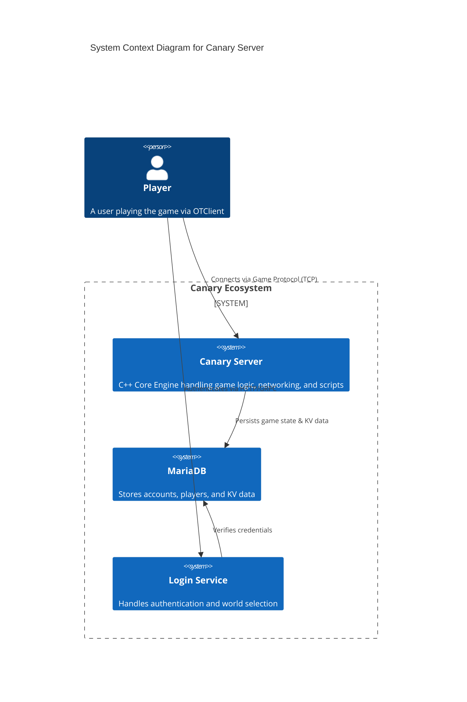

# Canary 🦜
> *The next-generation OpenTibia Server Emulator.*

[](https://discord.gg/gvTj5sh9Mp)
[](https://github.com/opentibiabr/canary/actions/workflows/ci.yml)
[](https://sonarcloud.io/dashboard?id=opentibiabr_canary)

[](https://github.com/opentibiabr/canary/blob/main/LICENSE)

**Canary** is a free, open-source MMORPG server emulator written in C++20 and Lua. It is designed for performance, stability, and ease of use, serving as the modern successor to the OpenTibia legacy.

---

## 🚀 Why Canary?

- **Modern Core**: Built with C++20 standards for maximum performance.
- **Robust Scripting**: Extensive Lua API for gameplay systems, events, and AI.
- **Data Persistence**: Integrated KV (Key-Value) store abstraction on top of MySQL.
- **Docker First**: Ready-to-deploy containerized environment.
- **Active Community**: Supported by OpenTibiaBR and a global network of contributors.

---

## ⚡ Quick Start

The fastest way to get Canary running is using **Docker**.

### Prerequisites
- Docker & Docker Compose

### 1-Command Setup
```bash
cd docker
docker-compose up -d
```

This will spin up:
- **Canary Server**: The game server core (Ports: 7171, 7172)
- **Database**: MariaDB with auto-initialized schema (Port: 3306)
- **Login Server**: Web API for authentication (Port: 8080)

> **Note**: The server creates a default `god` account. Check `schema.sql` or logs for details.

---

## 🗺️ Architecture Overview

Canary follows a modular architecture separating the core C++ engine from the dynamic Lua content.



---

## 📚 Documentation

We believe in **documentation as a product**. Explore our guides below:

| Guide | Description |
| :--- | :--- |
| [**Architecture Map**](docs/ARCHITECTURE.md) | Deep dive into the C4 Container diagrams, Sequence flows, and Database Schema. |
| [**Developer Guide**](docs/DEVELOPER_GUIDE.md) | How to build from source, project structure, and the KV System. |
| [**Contributing**](CONTRIBUTING.md) | Guidelines for submitting PRs, coding standards, and Code of Conduct. |
| [**KV System**](src/kv/README.md) | Technical reference for the Key-Value storage system. |

---

## 🤝 Support & Community

- **Discord**: [Join our server](https://discord.gg/gvTj5sh9Mp) for real-time support.
- **Issues**: [Report bugs](https://github.com/opentibiabr/canary/issues) on GitHub.

## 📄 License

Canary is released under the [GNU GPLv3 License](LICENSE).
