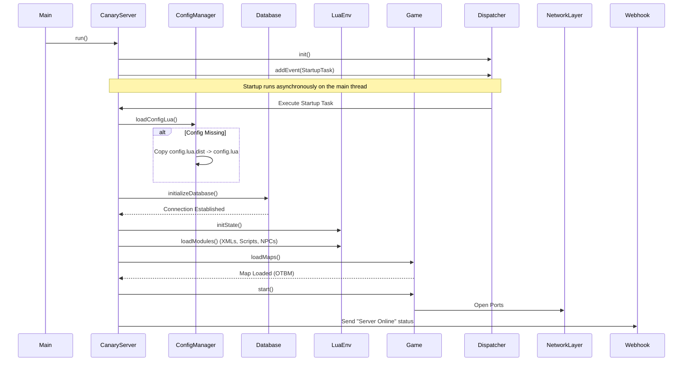
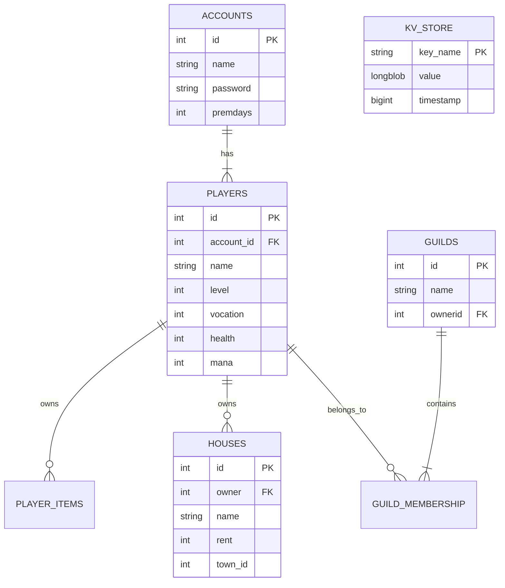

# Architecture Documentation 🏛️

This document provides a technical deep-dive into the Canary Server architecture, following the C4 Model and standard UML practices.

---

## 1. System Architecture (C4 Container)

Canary acts as a monolithic game server with distinct internal layers for networking, game logic, and data persistence.

```mermaid
C4Container
    title Container Diagram for Canary Server

    Person(Player, "Player", "Uses OTClient/Tibia Client")

    System_Boundary(CanaryHost, "Canary Server Host") {
        Container(NetworkLayer, "Network Layer", "Boost.Asio", "Handles TCP/IP connections, packet encryption (XTEA/RSA)")
        Container(GameEngine, "Game Engine", "C++20", "Core loop, collision detection, pathfinding")
        Container(LuaVM, "Lua Environment", "LuaJIT", "Executes scripts for spells, NPCs, raids, and quests")
        Container(Dispatcher, "Dispatcher", "Thread Pool", "Manages task scheduling and async events")
    }

    ContainerDb(Database, "MariaDB", "MySQL Protocol", "Stores persistent data (Players, Houses, KV Store)")
    Container(LoginServer, "Login Server", "Go/C++", "Handles authentication and character list retrieval")

    Rel(Player, LoginService, "1. Authenticates", "HTTP/GRPC")
    Rel(Player, NetworkLayer, "2. Connects to Game", "TCP (7171/7172)")

    Rel(NetworkLayer, GameEngine, "Forwards Packets")
    Rel(GameEngine, LuaVM, "Invokes Scripts")
    Rel(LuaVM, GameEngine, "Calls C++ API")

    Rel(GameEngine, Dispatcher, "Schedules Tasks")
    Rel(GameEngine, Database, "Reads/Writes Data")
```

---

## 2. Server Startup Sequence

The following sequence illustrates the initialization process from `main.cpp` to a fully running server state.



---

## 3. Database Schema (ER Diagram)

Canary uses a relational database for structured data and a Key-Value (KV) store for flexible property storage.



## 4. Key Systems

### The KV Store
Canary moves away from adding endless columns to the `players` table by using a `kv_store`. This allows developers to store complex structures (maps, arrays) or simple values attached to a player or global scope without database migrations.

### The Dispatcher
The server is single-threaded for game logic to avoid race conditions, but uses a `Dispatcher` to handle tasks. Long-running operations (like database saves) should be handled carefully to avoid blocking the main loop.
