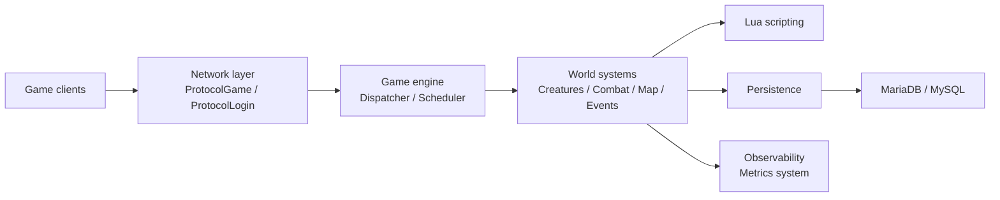

# Canary Architecture

## Overview

Canary is an open-source MMORPG server emulator for Tibia-based games, developed by the OpenTibiaBR community. It is primarily written in **C++20** for performance-critical systems and **Lua** for gameplay scripting and customization.

The project follows a layered architecture that separates networking, game logic, persistence, scripting, and tooling. This design allows server developers to customize game behavior without modifying the core engine while maintaining scalability and performance.

---

# High-Level Architecture



---

# Core Architectural Principles

## 1. Layered Design

Canary separates responsibilities into independent layers:

| Layer          | Responsibility             |
| -------------- | -------------------------- |
| Network        | Client communication       |
| Game Engine    | World simulation and rules |
| Scripting      | Gameplay customization     |
| Persistence    | Database operations        |
| Infrastructure | Metrics, logging, tooling  |

This separation allows gameplay changes through Lua while keeping the C++ core stable.

---

## 2. Hybrid C++ + Lua Architecture

### C++ Core

The server engine handles:

* Networking
* Pathfinding
* Combat calculations
* Creature management
* Item management
* Map management
* Database access
* Threading and scheduling

### Lua Layer

Lua scripts provide:

* NPC behavior
* Quests
* Actions
* Movements
* Talkactions
* Spells
* Events
* Custom gameplay systems

This architecture enables rapid feature development without recompiling the server.

---

# Repository Structure

```text
canary/
│
├── src/
├── data/
├── data-canary/
├── data-otservbr-global/
├── docs/
├── tests/
├── docker/
├── tools/
├── metrics/
│
├── schema.sql
├── config.lua.dist
└── CMakeLists.txt
```

---

# Source Code Architecture

## src/

Contains the entire C++ server implementation.

### Main Subsystems

```text
src/
├── game/
├── creatures/
├── items/
├── map/
├── io/
├── lua/
├── server/
├── utils/
└── lib/
```

---

# Game Engine

## Game Singleton

The `Game` class acts as the central coordinator of the server.

Responsibilities include:

* World state management
* Player tracking
* Creature tracking
* Event dispatching
* Combat orchestration
* Item management
* Map interaction

Conceptually:

```text
Game
 ├── Players
 ├── Monsters
 ├── NPCs
 ├── Items
 ├── Map
 ├── Events
 └── Lua Engine
```

The Game instance is effectively the heart of the server runtime.

---

# Network Layer

Located primarily under:

```text
src/server/network/
```

Responsibilities:

* TCP communication
* Packet parsing
* Encryption
* Login protocol
* Game protocol

Main protocols:

## ProtocolLogin

Handles:

* Authentication
* Character list retrieval
* Session initialization

## ProtocolGame

Handles:

* Movement
* Combat
* Chat
* Inventory updates
* World synchronization

---

# Creature System

Located under:

```text
src/creatures/
```

Inheritance hierarchy:

```text
Creature
├── Player
├── Monster
└── NPC
```

Shared functionality:

* Health
* Position
* Conditions
* Combat
* Movement

Specialized behavior is implemented by subclasses.

---

# Player Architecture

The Player object is one of the most complex entities in Canary.

Responsibilities:

* Skills
* Experience
* Inventory
* Equipment
* Storage values
* Quests
* Achievements
* Cyclopedia data
* Character progression

Player data is loaded from and saved to the database through the IO layer.

---

# Combat System

The combat subsystem manages:

* Melee attacks
* Distance attacks
* Magic damage
* Healing
* Conditions
* Area effects

Flow:

```text
Attack
  ↓
Combat Calculation
  ↓
Damage Modifiers
  ↓
Condition Processing
  ↓
Health Update
  ↓
Client Notification
```

---

# Map System

Located under:

```text
src/map/
```

Responsibilities:

* Tile management
* Visibility checks
* Pathfinding
* Spawn management
* House ownership
* Dynamic world updates

The map acts as the persistent world container.

---

# Event System

Canary is highly event-driven.

Examples:

* onLogin
* onLogout
* onThink
* onMove
* onUse
* onDeath
* onKill

Events can be implemented in Lua, enabling customization without modifying C++ code.

---

# Lua Scripting Engine

Located under:

```text
src/lua/
data/scripts/
```

The Lua engine exposes C++ objects to scripts through bindings.

Examples:

```lua
player:addItem()
player:addExperience()
creature:getHealth()
Game.getPlayers()
```

The scripting layer serves as the primary extension point for custom servers.

---

# Persistence Layer

Located under:

```text
src/io/
```

Responsibilities:

* Character loading
* Character saving
* Account management
* House persistence
* Guild persistence
* Market persistence

Database operations are isolated from gameplay systems.

---

# Database Architecture

Canary uses MariaDB/MySQL.

Schema definition:

```text
schema.sql
```

Main entities:

```text
accounts
players
guilds
houses
items
market
player_storage
player_skills
```

The database acts as the authoritative persistent state of the game world.

---

# Scheduler and Dispatcher

Canary uses asynchronous execution for performance.

## Scheduler

Handles:

* Delayed events
* Timers
* Creature thinking
* Regeneration

## Dispatcher

Handles:

* Queued game tasks
* Safe game-state modifications
* Thread synchronization

Flow:

```text
Incoming Event
       ↓
 Dispatcher Queue
       ↓
 Game Thread
       ↓
 World Update
```

This prevents race conditions and maintains world consistency.

---

# Data Packs

## data/

Contains shared engine resources and reusable Lua systems loaded by the server,
including:

* Actions
* Spells
* Quests
* Movements
* Talkactions
* Core libraries
* Shared event scripts

Use this directory for shared systems that are not specific to one datapack.

---

## data-canary/

Contains the lightweight Canary datapack.

Examples:

* New quests
* New monsters
* New mechanics
* NPCs
* Raids
* World files

---

## data-otservbr-global/

Contains the larger OTServBR-Global datapack used by the default Docker
quickstart. It includes the full global world content, monsters, NPCs, raids,
startup scripts and migrations for that datapack.

---

# Metrics and Observability

Located under:

```text
metrics/
src/lib/metrics/
```

Provides:

* Runtime metrics
* Performance monitoring
* Diagnostics

Useful for:

* Server optimization
* Capacity planning
* Production monitoring

---

# Testing Architecture

Located under:

```text
tests/
```

Purpose:

* Regression testing
* Engine validation
* Feature verification

Tests are integrated with CMake and CI pipelines.

---

# Docker Architecture

Located under:

```text
docker/
```

Local Docker quickstart stack:

```text
┌──────────────────────────────┐
│ MariaDB                      │
└───────────────┬──────────────┘
                │
┌───────────────▼──────────────┐
│ Canary runtime image         │
│ data-otservbr-global default │
└───────────────┬──────────────┘
                │
       ┌────────┴─────────┐
       ▼                  ▼
┌────────────┐    ┌────────────────┐
│ MyAAC      │    │ login-server   │
│ website    │    │ client login   │
└────────────┘    └────────────────┘
```

This enables local development, local testing and LAN demos without compiling
Canary locally. It is not the production deployment model with default settings;
see `docker/DOCKER.md` for the quickstart contract.

---

# Build System

Canary uses:

* CMake
* vcpkg
* GitHub Actions

Supported platforms:

* Linux
* Windows
* macOS

Compilation flow:

```text
CMake
  ↓
Dependency Resolution
  ↓
Compilation
  ↓
Executable
```

---

# Design Patterns Used

## Singleton

Used by:

* Game
* Configuration
* Managers

Purpose:

* Centralized access to global services

---

## Component-Oriented Design

Player-related features are split into specialized modules.

Examples:

* Storage
* Wheel system
* Cyclopedia
* Inventory systems

This reduces coupling.

---

## Event-Driven Architecture

Most gameplay interactions are triggered by events.

Benefits:

* Extensibility
* Scriptability
* Loose coupling

---

## Transaction-Based Persistence

Database writes are grouped into transactions.

Benefits:

* Data consistency
* Safe player saves
* Reduced corruption risk

---

# Request Lifecycle

Example: Player Movement

```text
Client
  ↓
ProtocolGame
  ↓
Packet Parsing
  ↓
Dispatcher
  ↓
Game
  ↓
Map Validation
  ↓
Position Update
  ↓
Lua Events
  ↓
Client Update
```

---

# Summary

Canary combines:

* High-performance C++20 systems
* Flexible Lua scripting
* Event-driven gameplay
* Transactional persistence
* Modular architecture

The result is a modern MMORPG server platform capable of supporting highly customized Tibia-based game worlds while remaining maintainable, extensible and performant.
