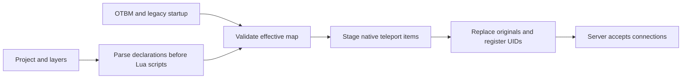

# World layers v1

World layers describe external map objects in JSON. Canary and RME read the same
project. The OTBM supplies terrain and existing items; a layer supplies stable
object identities, positions, attributes, replacement selectors and relationships.
Canary creates native teleport items during startup. RME displays and edits the
external objects over the native map canvas without saving those changes into OTBM.

## Start with Black Knight

The global datapack includes `data-otservbr-global/world/otservbr.world.json` and
`data-otservbr-global/world/layers/black_knight.layer.json`. Install the normal
`otservbr.otbm` alongside the project, as with the existing datapack setup.

`worldProject = "auto"` is the default. It discovers
`<dataPackDirectory>/world/<mapName>.world.json`. If the auto-discovered file is
absent, startup uses the existing loader. If a file is found but invalid, startup
fails before accepting connections. An explicit path must exist and its map and
item catalog must match the configured server paths.

Set `worldProject = ""` and restart to return to the original Black Knight
teleports and legacy UID loader. Changes to this setting or the layer require a
restart. Reloading Lua does not reread world layers.

Open `otservbr.otbm` normally in a compatible RME; its sibling world catalog loads
automatically. For a catalog stored elsewhere, use **Map > Load Server Worlds...**
or configure its path beside the NPC and monster paths in Preferences. **Worlds**
is a category of the normal palette. Select and drag external portals on the map,
or double-click them to edit their normal item properties. **Go to arrival**
navigates across floors. Terrain and ordinary items remain editable in the same
tab. Ctrl+S writes world changes to layers and base-map changes to OTBM; changing
only a world object does not serialize the OTBM. Undo/redo follows one timeline.

## Project and layer contract

The schemas are `schemas/world-project-v1.schema.json` and
`schemas/world-layer-v1.schema.json`. `schemaVersion` is 1. Unknown fields,
unknown components, unsupported versions and duplicate JSON properties are errors.
Each document is limited to 16 MiB. Paths are relative to the project file and
use forward slashes. Layer loading follows an explicit ordered list, with no glob
search or implicit override precedence.

```json
{
  "schemaVersion": 1,
  "map": "otservbr.otbm",
  "items": "../../data/items/items.xml",
  "layers": ["layers/black_knight.layer.json"]
}
```

A layer has an `id`, optional display `name`, and `objects`. An object has an `id`,
optional display `name`, `position`, `origin`, optional `attributes` and optional
`components`. Qualified identity is `<layer.id>.<object.id>`, such as
`black_knight.entry`. Object identity is independent of AID and UID.

- Layer IDs use lowercase letters, digits and underscores, starting with a letter.
  Local object IDs additionally allow dots and hyphens. Each part is at most 128 characters.
- Positions have integer X/Y in 0..65535 and floor in 0..15. The null position is invalid.
- `origin.type` is `layer`; `origin.itemId` must identify a native teleport in v1.
- `origin.replaces`, when present, selects one original teleport by its original
  position and item ID. Exactly one match is required. This anchor does not move
  when the external object moves, and two objects cannot consume the same original.
- AID may repeat. UID must be unique across layers and the effective map, including
  container contents. Zero means unset. A UID on a consumed original is permitted;
  the same UID anywhere else is an error.
- The optional `teleport` component names a qualified destination object plus an
  optional integer `destinationOffset`. The arrival is the target object's current
  position plus this offset. Without the component, the native teleport is inert.
- Version 1 allows one external object per tile. Creation and arrival tiles need
  ground and must be unblocked and outside houses. Competing base-map teleports,
  missing references, out-of-range arrivals and effective teleport cycles are errors.

The model and map-independent validator are maintained in `src/world` and in the
editor's corresponding `source/world` directory. A contract change must update both
implementations, schemas and fixtures together. Runtime and editor adapters supply
map snapshots to the same validator; neither adapter executes layer files as Lua.

## Runtime ownership and load order



The runtime is owned by `Game`. Declarations load before datapack scripts register
events. After maps, legacy startup and house transfers, the runtime validates the
whole project, stages its items, removes consumed originals, inserts replacements
and registers their UIDs. Normal validation failures mutate no items. An application
failure restores staged changes through a rollback journal and aborts startup.
No live reload or background mutation is introduced.

UID validation reads both materialized items and cached `BasicTile`/`BasicItem`
records, descending into containers. It does not materialize the complete map.
The existing unique-item registry is also checked for items outside map tiles.
Only the small set of affected tiles and teleport-chain destinations need resolution.

The created objects use `Teleport::setDestPos` and the existing native teleport
behavior for players, monsters, NPCs, items and effects. There is no additional Lua
movement handler for migrated portals.

`Game.isWorldObjectDeclared(id)` reports a declaration, not current item existence.
It is available during script registration and remains stable through Lua reload.
The two pilot legacy entries keep their original values and add `worldObject`.
That marker suppresses legacy UID assignment and movement registration only while
the corresponding object is declared. Invalid declarations stop startup; they do
not silently fall back to a partially migrated world.

## Pilot behavior

| Object | Position | Arrival | UID |
| --- | --- | --- | --- |
| `black_knight.entry` | 32874,31941,12 | 32874,31948,11 | 38012 |
| `black_knight.exit` | 32874,31955,11 | 32874,31942,12 | 38013 |

Both retain item 1949. Entry targets exit with offset `(0,-7,0)`; exit targets
entry with `(0,1,0)`. These offsets preserve the existing quest arrivals and avoid
landing directly on the opposite portal. Moving an endpoint moves the corresponding
arrival while the replacement selector continues to identify the original OTBM item.

## Validation

Run the standalone legacy ownership regression from the repository root:

```sh
lua tests/world_layers/legacy_test.lua
```

The `WorldLayers.*` unit tests cover identity-based arrivals, UID/AID rules,
replacement ambiguity, missing ground, houses, map UID conflicts, serialization,
unsupported fields and effective cycles. Build and run them only through the
authorized local build workflow in `docs/building/local-validation.md`.

Before releasing changes to this contract, also run the editor's headless contract
test and the following integration scenario on a local server and map copy:

1. Record the OTBM hash, open the OTBM in RME and inspect both original locations.
   Each effective portal must appear once. Hide the layer to inspect the originals.
2. Move the exit to a valid tile, undo, redo and save. Reopen the OTBM. The exit
   and entry's resolved arrival must follow the edit, and the OTBM hash must match.
3. Start Canary with the edited project. Verify native travel with a player, an NPC
   or monster, and a movable item, including arrival position and effects.
4. Verify failure before online state for an ambiguous original, missing tile,
   duplicate UID, missing target and a cycle. Check a UID conflict in a cached tile
   and a container, not just a materialized tile.
5. Disable `worldProject` and restart. Confirm the original Black Knight positions,
   destinations and legacy registration return. Unrelated quests must be unchanged.

## Scope

Temporary/decaying teleport items are not supported as replacements in v1.

Version 1 edits existing external objects: position, AID/UID and teleport relation.
It does not move base items, change the OTBM format, execute arbitrary components,
rename/create/delete identities in the GUI, provide a generic Lua object API, or
migrate the remaining legacy tables. Custom map loads that replace an active
object's region are not a supported world-layer reload mechanism.

RME can save a structurally valid draft with semantic diagnostics. Canary rejects
that draft at startup. RME validates against the base map and project catalog;
Canary performs the final validation after legacy scripts, so runtime-only changes
can produce additional diagnostics. Layer files are saved atomically one at a time;
a multi-layer save is not a filesystem-wide transaction. External project/layer
changes block overwrite and remain available for manual reconciliation.
